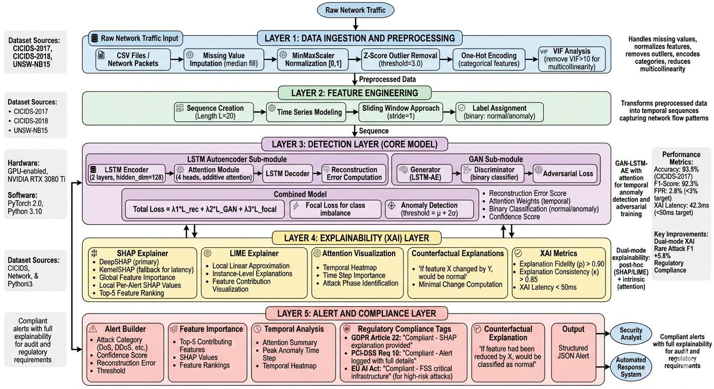

# XAI-IntrusionDetector

**Explainable AI Framework for Network Intrusion Detection**

[](https://www.python.org/)
[](https://pytorch.org/)
[](LICENSE)

A deep learning framework for network intrusion detection combining GAN-LSTM-Autoencoder architecture with explainable AI (SHAP and LIME) for interpretable cyber threat detection.

## Architecture Diagram

<p align="center">  </p>

<h1 align="center">Proposed Architecture</h1>

## 📋 Project Overview

XAI-IntrusionDetector is designed to detect network intrusions and cyber threats using deep learning models while providing interpretable explanations for model predictions. The project combines:

- **GAN-LSTM-Autoencoder**: Novel architecture combining LSTM Autoencoder, Attention mechanism, and GAN Discriminator for anomaly detection
- **Explainable AI**: SHAP (global) and LIME (local) explainers for model interpretation and feature importance
- **Modular Architecture**: Clean separation of concerns for data loading, training, evaluation, and inference
- **Class Imbalance Handling**: SMOTE integration for handling imbalanced datasets common in security applications
- **Feature Selection**: Variance Inflation Factor (VIF) filtering for optimal feature selection
- **Multiple Dataset Support**: CICIDS2017, CICIDS2018, and UNSW-NB15 datasets

## 🏗️ Architecture

The model uses a hybrid architecture with three main components:

1. **LSTM Autoencoder**: Encodes input sequences into latent representations and reconstructs them
2. **Attention Mechan**: Learns which time steps are most important for reconstruction
3. **GAN Discriminator**: Distinguishes between real and reconstructed sequences for adversarial training

Anomalies are detected based on reconstruction error - higher error indicates potential intrusion.


## 📁 Project Structure

```
XAI-IntrusionDetector/
├── data/
│   └── raw/              # Raw dataset files (CSV)
├── src/
│   ├── data/             # Data loading and preprocessing
│   │   ├── loader.py     # Generic CSV loader
│   │   ├── cicids2017_loader.py
│   │   ├── cicids2018_loader.py
│   │   ├── unsw_nb15_loader.py
│   │   ├── preprocessing.py  # Scaling and cleaning
│   │   ├── vif_filter.py     # VIF-based feature selection
│   │   └── feature_engineering.py  # Sequence creation
│   ├── models/           # Model architectures
│   │   ├── gan_lstm_ae.py    # Combined GAN-LSTM-Autoencoder
│   │   ├── lstm_autoencoder.py
│   │   ├── attention.py
│   │   └── gan.py
│   ├── training/         # Training logic
│   │   ├── train.py      # Main training pipeline
│   │   ├── trainer.py    # Trainer class
│   │   └── loss_functions.py
│   ├── evaluation/       # Model evaluation
│   │   ├── evaluator.py  # Evaluation pipeline
│   │   ├── metrics.py    # Metrics computation
│   │   └── benchmark.py
│   ├── xai/              # Explainable AI
│   │   ├── shap_explainer.py
│   │   ├── lime_explainer.py
│   │   ├── attention_visualizer.py
│   │   └── explanation_metrics.py
│   ├── pipeline/         # Inference pipeline
│   │   ├── detect.py     # Detection pipeline
│   │   ├── inference.py  # Inference engine
│   │   └── alert_builder.py
│   ├── config.py         # Configuration management
│   ├── model.py          # Legacy model definitions
│   ├── trainer.py        # Legacy trainer.
│   ├── evaluator.py      # Legacy evaluator
│   ├── explainer.py      # Legacy explainer
│   ├── pipeline.py       # Legacy pipeline
│   └── api_server.py     # Flask API server
├── models/               # Saved model checkpoints and metadata
├── results/              # Evaluation results and visualizations
│   ├── metrics/          # CSV and JSON metrics
│   ├── plots/            # Confusion matrix, ROC curves
│   ├── tables/           # Result tables
│   └── xai/              # SHAP/LIME visualizations
├── experiments/          # Experiment configurations and logs
├── api/                  # API-related files
├── run.py                # Main entry point
├── requirements.txt      # Python dependencies
├── Architecture_diagram.png
├── Research Paper.pdf
└── README.md             # This file
```

## 📦 Requirements

- Python 3.10+
- PyTorch 2.0+
- CUDA (optional, for GPU acceleration)

See `requirements.txt` for full dependency list.

## 🚀 Installation

1. **Clone the repository**
```bash
git clone https://github.com/yourusername/XAI-IntrusionDetector.git
cd XAI-IntrusionDetector
```

2. **Create a virtual environment** (recommended)
```bash
python -m venv venv
# On Windows:
venv\Scripts\activate
# On Linux/Mac:
source venv/bin/activate
```

3. **Install dependencies**
```bash
pip install -r requirements.txt
```

4. **Prepare data**
Place your dataset CSV files in the `data/raw/` directory. Supported datasets:
- CICIDS2017
- CICIDS2018
- UNSW-NB15
- Any custom CSV with numeric features and a label column

## 💻 Usage

The project runs from `run.py` with three main modes:

### Training Mode

Train the intrusion detection model:
```bash
python run.py --train --data_dir data/raw --model_dir models --seq_len 20 --hidden_dim 128 --epochs 100 --batch_size 32 --lr 0.001
```

**Parameters:**
- `--data_dir`: Directory containing CSV files (default: `data/raw`)
- `--model_dir`: Directory to save models (default: `models`)
- `--seq_len`: Sequence length for LSTM (default: 20)
- `--hidden_dim`: Hidden dimension for LSTM (default: 128)
- `--epochs`: Number of training epochs (default: 100)
- `--batch_size`: Batch size for training (default: 32)
- `--lr`: Learning rate (default: 0.001)

**Training Pipeline:**
1. Loads and merges CSV files from data directory
2. Preprocesses data (scaling, cleaning)
3. Applies VIF filtering for feature selection
4. Creates sequences for LSTM
5. Applies SMOTE for class imbalance handling
6. Trains GAN-LSTM-Autoencoder model
7. Saves model, scaler, feature info, and metadata

### Evaluation Mode

Evaluate a trained model:
```bash
python run.py --evaluate --data_dir data/raw --model_dir models --results_dir results
```

**Evaluation outputs:**
- Metrics: Accuracy, Precision, Recall, F1 Score, AUC-ROC
- Confusion matrix plot: `results/plots/confusion_matrix.png`
- ROC curve: `results/plots/roc_curve.png`
- CSV metrics: `results/metrics/accuracy.csv`, `results/metrics/f1_scores.csv`, etc.
- JSON metrics: `results/metrics/all_metrics.json`

### Detection Mode

Run detection on new data:
```bash
python run.py --detect --model_dir models
```

This generates a sample prediction with explanation for demonstration purposes.

## 🧪 Advanced Usage

### Using Specific Dataset Loaders

For specific datasets, use the dedicated loaders:

```python
from src.data.cicids2017_loader import load_cicids2017
from src.data.cicids2018_loader import load_cicids2018
from src.data.unsw_nb15_loader import load_unsw_nb15

df = load_cicids2017("data/raw")
```

### XAI Explanations

Generate SHAP and LIME explanations:

```python
from src.xai.shap_explainer import SHAPExplainer
from src.xai.lime_explainer import LIMEExplainer

# Initialize explainers
shap_explainer = SHAPExplainer("models/model.pt", "models/scaler.pkl")
lime_explainer = LIMEExplainer("models/model.pt", "models/scaler.pkl")

# Initialize with background/training data
shap_explainer.initialize_explainer(background_data)
lime_explainer.initialize_explainer(training_data)

# Explain a sample
shap_result = shap_explainer.explain(sample, top_k=5)
lime_result = lime_explainer.explain(sample, num_features=10)
```

### Inference Pipeline

Use the detection pipeline for real-time inference:

```python
from src.pipeline.detect import DetectionPipeline

pipeline = DetectionPipeline("models/model.pt", "models/scaler.pkl")

# Compute threshold from normal samples
threshold = pipeline.compute_threshold(normal_samples, multiplier=2.0)

# Detect anomalies
result = pipeline.detect_anomaly(sample)
print(f"Is anomaly: {result['is_anomaly']}")
print(f"Reconstruction error: {result['reconstruction_error']}")
print(f"Confidence: {result['confidence']}")
```

## 📊 Model Outputs

### Training Mode
- **Model checkpoint**: `models/model.pt` - Trained GAN-LSTM-Autoencoder model
- **Scaler**: `models/scaler.pkl` - Fitted MinMaxScaler for preprocessing
- **Feature info**: `models/feature_info.pkl` - VIF filter information (removed/remaining features)
- **Metadata**: `models/model_metadata.pkl` - Model architecture parameters

### Evaluation Mode
- **Metrics CSV**: `results/metrics/accuracy.csv`, `results/metrics/f1_scores.csv`, `results/metrics/fpr.csv`
- **All metrics JSON**: `results/metrics/all_metrics.json` - Complete evaluation metrics
- **Confusion matrix plot**: `results/plots/confusion_matrix.png`
- **ROC curve**: `results/plots/roc_curve.png`
- **Console output**: Detailed classification report and metrics

### XAI Explanations
- **SHAP values**: Feature importance scores for global interpretability
- **LIME explanations**: Local explanations for individual predictions
- **Attention visualizations**: Time-step importance from attention mechanism
- **Explanation metrics**: Quantitative measures of explanation quality

## 📈 Key Features

- **Novel Architecture**: GAN-LSTM-Autoencoder with attention for robust anomaly detection
- **Explainable AI**: Both global (SHAP) and local (LIME) explanations for model interpretability
- **Feature Selection**: VIF-based filtering to remove multicollinear features
- **Class Imbalance Handling**: SMOTE integration for balanced training
- **Multiple Dataset Support**: CICIDS2017, CICIDS2018, UNSW-NB15, and custom datasets
- **Modular Design**: Easy to extend and modify individual components
- **Early Stopping**: Prevents overfitting with patience-based early stopping
- **Comprehensive Metrics**: Accuracy, Precision, Recall, F1 Score, AUC-ROC, Confusion Matrix
- **Real-time Inference**: Detection pipeline for live anomaly detection
- **Attention Visualization**: Understand which time steps contribute to predictions

## 🔧 Configuration

The project uses default configuration but can be customized via command-line arguments. Key parameters:

**Data Processing:**
- Sequence length: Controls temporal context for LSTM
- VIF threshold: Feature selection threshold (default: 5.0)
- SMOTE sampling: Class imbalance handling strategy

**Model Architecture:**
- Hidden dimension: LSTM hidden state size
- Number of layers: LSTM depth (default: 2)
- Use attention: Enable/disable attention mechanism

**Training:**
- Learning rate: Optimizer learning rate
- Batch size: Training batch size
- Epochs: Maximum training epochs
- Early stopping patience: Epochs to wait for improvement

## 📁 Data Format

The project expects CSV files with:
- **Features**: Numeric columns for network traffic features
- **Label**: Binary label (0 = normal/benign, 1 = attack/intrusion)

Supported label column names: `label`, `Label`, `class`, `Class`, `attack`, `Attack`, `outcome`, `Outcome`

If no explicit label column is found, the last column is used as the label.

## 🧬 Model Architecture Details

### GAN-LSTM-Autoencoder

The model combines three components:

1. **LSTM Autoencoder**
   - Encoder: Compresses input sequences to latent representations
   - Decoder: Reconstructs sequences from latent representations
   - Reconstruction error used for anomaly detection

2. **Attention Mechanism**
   - Learns importance weights for each time step
   - Helps model focus on relevant temporal patterns
   - Provides interpretable attention weights

3. **GAN Discriminator**
   - Distinguishes between real and reconstructed sequences
   - Improves reconstruction quality through adversarial training
   - Enhances model robustness

### Detection Mechanism

Anomalies are detected based on reconstruction error:
- Normal traffic: Low reconstruction error (model learns to reconstruct well)
- Intrusions: High reconstruction error (model fails to reconstruct anomalous patterns)

Threshold is computed as: `mean_error + multiplier * std_error`

## 📚 Citation

If you use this project in your research, please cite:

```bibtex
@misc{xai-intrusiondetector,
  title={XAI-IntrusionDetector: Explainable AI Framework for Network Intrusion Detection},
  author={Your Name},
  year={2024},
  howpublished={\url{https://github.com/yourusername/XAI-IntrusionDetector}}
}
```

See `Research Paper.pdf` for detailed methodology and experimental results.

## 🤝 Contributing

Contributions are welcome! Please feel free to submit a Pull Request.

1. Fork the repository
2. Create your feature branch (`git checkout -b feature/AmazingFeature`)
3. Commit your changes (`git commit -m 'Add some AmazingFeature'`)
4. Push to the branch (`git push origin feature/AmazingFeature`)
5. Open a Pull Request

## 📝 License

This project is for educational and research purposes. Please see the research paper for more details on usage and attribution.

## 🐛 Issues

For questions, bug reports, or feature requests, please open an issue in the project repository.

## 🔗 Related Resources

- [CICIDS2017 Dataset](https://www.unb.ca/cic/datasets/ids-2017.html)
- [CICIDS2018 Dataset](https://www.unb.ca/cic/datasets/ids-2018.html)
- [UNSW-NB15 Dataset](https://www.unsw.adfa.edu.au/unsw-canberra-cyber-security/cyber-security-research-data-sets/unsw-nb15-data-sets/)
- [SHAP Documentation](https://shap.readthedocs.io/)
- [LIME Documentation](https://lime-ml.readthedocs.io/)

## 📧 Contact

For questions or issues, please open an issue in the project repository or contact [syedbilal8803@gmail.com].

---

**Note**: This is a research project. For production use, additional security hardening and testing are recommended.
